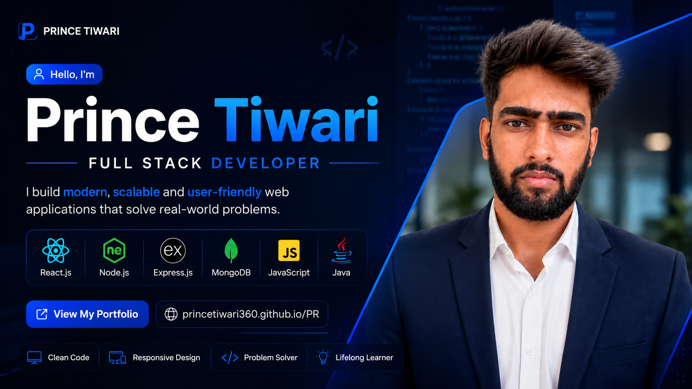

  

<h1 align="center">Hi , I'm Prince Tiwari</h1>

<h3 align="center">
 Full Stack Developer | MERN Stack | Java Developer
</h3>

Building scalable, responsive and modern web applications.

---

#  About Me

-  MCA Student at Galgotias University
-  Full Stack Developer
-  Currently learning Advanced MERN Stack & System Design
-  Passionate about building scalable web applications
-  Java + MERN Stack Enthusiast
-  Email: **tiwariprince340@gmail.com**
-  Portfolio: https://princetiwari360.github.io/PR/
-  LinkedIn: https://www.linkedin.com/in/prince-tiwari-662084233/

---

#  Tech Stack

---

#  Featured Projects

##  Developer Portfolio

Modern responsive portfolio website.

 https://princetiwari360.github.io/PR/

---

##  MERN Ecommerce

Responsive ecommerce application built using React, Node.js, Express.js and MongoDB.

---

##  FullStackMaster

Learning platform with responsive UI and modern design.

---

##  Healthcare Application

Healthcare Management System built using Java technologies.

---

#  GitHub Streak

---

#  Contribution Graph

---

#  Contribution Snake

---

#  Connect With Me

---

<h2 align="center"> Thanks for Visiting My GitHub Profile </h2>

